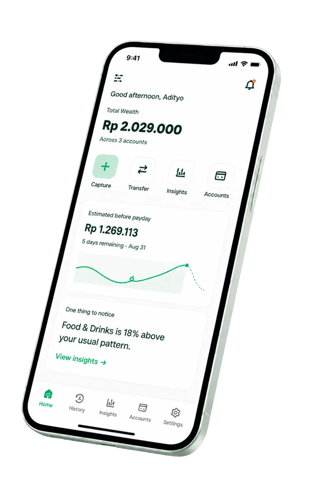

# SALDO

> Catat keuangan pribadi lewat satu kalimat santai, tanpa ribet buka form panjang dan dropdown bertingkat.

[Live Demo](https://usesaldo.vercel.app) · [GitHub Repository](https://github.com/adityafajarsy/mern-finance-tracker)

<br />

<p align="center">
  
</p>

---

## Tentang SALDO

Sebagian besar aplikasi pencatat keuangan ditinggalkan bukan karena fiturnya kurang, tapi karena proses inputnya melelahkan: harus pilih dompet, buka dropdown kategori, tentukan tanggal, lalu isi nominal secara manual setiap kali beli sesuatu.

**SALDO** dibuat untuk memangkas semua friksi itu. Cukup ketik atau ucapkan apa yang baru saja dibeli dalam bahasa sehari-hari (misal: _"tadi beli kopi 25rb pake gopay"_ atau _"kemarin bayar token listrik 150rb via bca"_), sistem akan mengenali nominal, akun sumber, kategori, serta tanggalnya secara otomatis.

---

## Fitur Utama

### 1. Natural Language Financial Capture (Teks & Suara)

Ketik atau rekam suara transaksi dalam bahasa santai sehari-hari. Sistem terintegrasi dengan AI parser yang mengenali format angka khas Indonesia (_"25k"_, _"50rb"_, _"2.5jt"_), istilah transaksi (_beli, bayar, checkout, terima transfer_), serta tanggal relatif (_kemarin, 3 hari lalu, tadi_). Dilengkapi _Intent Guard_ berlapis untuk memfilter obrolan non-finansial dan mencegah prompt injection.

### 2. Multi-Akun & Pemetaan Kategori Otomatis

Kelola berbagai dompet secara bersamaan (Tunai, Bank BCA, GoPay, OVO, ShopeePay, dll). Transaksi pengeluaran, pemasukan, maupun transfer antar-rekening pribadi langsung memperbarui saldo masing-masing dompet secara real-time dan terpetakan ke kategori yang sesuai.

### 3. Analisis Arus Kas & Prediksi Saldo Menjelang Gajian

Bukan sekadar daftar riwayat angka mentah. SALDO menghitung laju pengeluaran harian (_spending velocity_), rasio tabungan bulanan, perbandingan tren dari bulan sebelumnya, serta memproyeksikan estimasi sisa uang sebelum tanggal gajian berikutnya berdasarkan kebiasaan belanja nyata.

---

## Cara Kerja

```text
Ketik / Ucapkan Kalimat Transaksi
         ↓
Pengecekan Keamanan & Intent Guard (Penyaringan input non-finansial)
         ↓
Ekstraksi Data Terstruktur via AI (Nominal, Akun, Kategori, Tanggal)
         ↓
Pembaruan Saldo Akun & Rekonsiliasi Buku Kas Otomatis
         ↓
Wawasan Finansial & Proyeksi Saldo Diperbarui
```

---

## Tech Stack

- **Frontend**: React 19, Vite, Tailwind CSS v4, Lucide React, React Router v7
- **Backend**: Node.js, Express 5
- **Database**: MongoDB dengan Mongoose 9
- **AI & Parsing**: OpenRouter API (`openai/gpt-4o-mini`) dengan _heuristic intent guard_
- **Autentikasi & Keamanan**: JSON Web Tokens (JWT), bcryptjs, verifikasi OTP via email (Nodemailer)
- **Deployment**: Vercel (Frontend & Serverless API)

---

## Tampilan Aplikasi

<p align="center">
  
</p>

---

## Status Proyek

Aplikasi sudah live dan aktif digunakan di [usesaldo.vercel.app](https://usesaldo.vercel.app).
